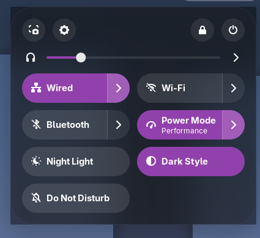
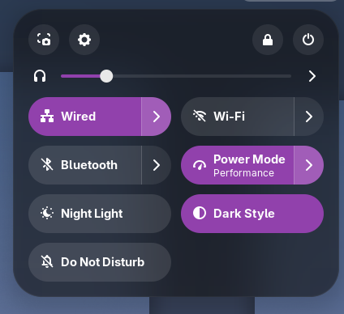

# gnome-rounded-blur-arch-fix

custom PKGBUILD for [gnome-rounded-blur](https://aur.archlinux.org/packages/gnome-rounded-blur) AUR package

This uses [a fork from darojatun](https://github.com/darojatun/gnome-rounded-blur/tree/gnome51) instead of the original [gnome-rounded-blur](https://github.com/kancko/gnome-rounded-blur) to temporarily fix the broken AUR package and work properly with GNOME 51.

Use at your own risk

## Install

```
git clone https://github.com/tbored/gnome-rounded-blur-arch-fix
cd gnome-rounded-blur-arch-fix
makepkg -si
```


<table>
  <tr>
    <td align="center">
      <br>
      before (not properly rounded corners)
    </td>
    <td align="center">
      <br>
      after (properly rounded corners)
    </td>
  </tr>
</table>
